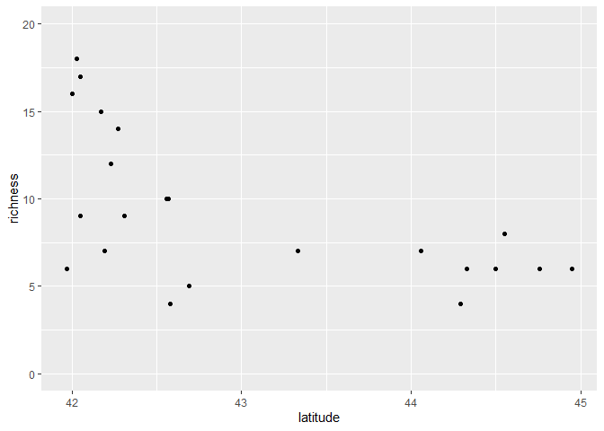

Ant data: k-fold cross validation
================
Brett Melbourne
23 Jan 2024

Investigate cross-validation **inference algorithm** with ants data and
a polynomial model. Our goal is to predict richness of forest ants from
latitude. What order of a polynomial **model algorithm** gives the most
accurate predictions?

``` r
library(ggplot2)
library(dplyr)
library(tidyr) #for pivot_longer()
```

Ant data:

``` r
ants <- read.csv("data/ants.csv")
head(ants)
```

    ##   site habitat latitude elevation richness
    ## 1  TPB  forest    41.97       389        6
    ## 2  HBC  forest    42.00         8       16
    ## 3  CKB  forest    42.03       152       18
    ## 4  SKP  forest    42.05         1       17
    ## 5   CB  forest    42.05       210        9
    ## 6   RP  forest    42.17        78       15

Forest ant data:

``` r
forest_ants <- ants |> 
    filter(habitat=="forest")

forest_ants |>
    ggplot() +
    geom_point(aes(x=latitude, y=richness)) +
    ylim(0,20)
```

<!-- -->

Here is one way we could code a 3rd order polynomial using R’s model
formula syntax.

``` r
lm(richness ~ latitude + I(latitude^2) + I(latitude^3), data=forest_ants)
```

    ## 
    ## Call:
    ## lm(formula = richness ~ latitude + I(latitude^2) + I(latitude^3), 
    ##     data = forest_ants)
    ## 
    ## Coefficients:
    ##   (Intercept)       latitude  I(latitude^2)  I(latitude^3)  
    ##    84336.3595     -5736.2100       130.0406        -0.9825

The `I()` function ensures that `^` is not interpreted as model formula
syntax. See `?formula` for more details. Briefly, model formulae provide
a shorthand notation for (mostly) linear models, e.g. `y ~ x + z` is
shorthand for the model:

$$
y = \beta_0 + \beta_1 x + \beta_2 z
$$

A more convenient way is the function `poly()`

``` r
lm(richness ~ poly(latitude, degree=3), data=forest_ants)
```

    ## 
    ## Call:
    ## lm(formula = richness ~ poly(latitude, degree = 3), data = forest_ants)
    ## 
    ## Coefficients:
    ##                 (Intercept)  poly(latitude, degree = 3)1  
    ##                       9.182                      -11.604  
    ## poly(latitude, degree = 3)2  poly(latitude, degree = 3)3  
    ##                       6.170                       -2.629

The difference in the parameter estimates from the previous approach is
because the parameterization is different. Use the argument `raw=TRUE`
for the same parameterization (see `?poly`). In machine learning we
don’t care about the parameter values, just the resulting prediction,
which is exactly the same for the two approaches. R’s `lm()` function
contains a **training** **algorithm** that finds the parameters that
minimize the sum of squared deviations of the data from the model.

Example plot of an order 4 polynomial model. Use this block of code to
try different values for the order (syn. degree) of the polynomial.

``` r
order <- 4 #integer
poly_trained <- lm(richness ~ poly(latitude, order), data=forest_ants)
grid_latitude  <- seq(min(forest_ants$latitude), max(forest_ants$latitude), length.out=201)
nd <- data.frame(latitude=grid_latitude)
pred_richness <- predict(poly_trained, newdata=nd)
preds <- cbind(nd, richness=pred_richness)

forest_ants |>
    ggplot() +
    geom_point(aes(x=latitude, y=richness)) +
    geom_line(data=preds, aes(x=latitude, y=richness)) +
    coord_cartesian(ylim=c(0,20)) +
    labs(title=paste("Polynomial order", order))
```

<!-- -->

Using `predict` to ask for predictions from the trained polynomial
model. For example, here we are asking for the prediction at latitude
43.2 and we find the predicted richness is 5.45.

``` r
predict(poly_trained, newdata=data.frame(latitude=43.2))
```

    ##        1 
    ## 5.450208

Exploring the k-fold CV algorithm

First, we need a function to divide the dataset up into partitions.

``` r
# Function to divide a data set into random partitions for cross-validation
# n:       length of dataset (scalar, integer)
# k:       number of partitions (scalar, integer)
# return:  partition labels (vector, integer)
# 
random_partitions <- function(n, k) {
    min_n <- floor(n / k)
    extras <- n - k * min_n
    labels <- c(rep(1:k, each=min_n),rep(seq_len(extras)))
    partitions <- sample(labels, n)
    return(partitions)
}
```

What does the output of `random_partitions()` look like? It’s a set of
labels that says which partition each data point belongs to.

``` r
random_partitions(nrow(forest_ants), k=5)
```

    ##  [1] 3 3 1 1 5 2 2 1 1 1 4 3 2 4 3 4 2 5 5 2 4 5

``` r
random_partitions(nrow(forest_ants), k=nrow(forest_ants))
```

    ##  [1] 20 18 14 21  5  8 11  1 15 10 17 13  7 19 16  2  9  3  6 22 12  4

Now code up the k-fold CV algorithm (from our pseudocode to R code) to
estimate the prediction mean squared error for one order of the
polynomial. We can run this block of code to try different values for
the order of the polynomial with 5-fold, 10-fold, or n-fold CV.

``` r
order <- 4
k <- 10

# divide dataset into k parts i = 1...k
forest_ants$partition <- random_partitions(nrow(forest_ants), k)

# initiate vector to hold e
e <- rep(NA, k)

# for each i
for ( i in 1:k ) {
#     test dataset = part i
    test_data <- forest_ants |> filter(partition == i)
#     training dataset = remaining data
    train_data <- forest_ants |> filter(partition != i)
#     find f using training dataset
    poly_trained <- lm(richness ~ poly(latitude, order), data=train_data)
#     use f to predict for test dataset
    pred_richness <- predict(poly_trained, newdata=test_data)
#     e_i = prediction error (mse)
    e[i] <- mean((test_data$richness - pred_richness) ^ 2)
}
# CV_error = mean(e)
cv_error <- mean(e)
cv_error
```

    ## [1] 15.55762

To help us do some systematic experiments to explore different
combinations of order and k we will encapsulate the above code as a
function. I have also removed dependencies on external libraries by
replacing the `filter()` function from `dplyr` with the base R function
`subset()`. Reducing dependencies in reusable components of code is good
programming practice.

``` r
# Function to perform k-fold CV for a polynomial model on ants data
# k:       number of partitions (scalar, integer)
# order:   degrees of polynomial (scalar, integer)
# return:  CV error as MSE (scalar, numeric)

cv_poly_ants <- function(k, order) {
    forest_ants$partition <- random_partitions(nrow(forest_ants), k)
    e <- rep(NA, k)
    for ( i in 1:k ) {
        test_data <- subset(forest_ants, partition == i)
        train_data <- subset(forest_ants, partition != i)
        poly_trained <- lm(richness ~ poly(latitude, order), data=train_data)
        pred_richness <- predict(poly_trained, newdata=test_data)
        e[i] <- mean((test_data$richness - pred_richness) ^ 2)
    }
    cv_error <- mean(e)
    return(cv_error)
}
```

Test/use the function

``` r
cv_poly_ants(k=10, order=8)
```

    ## [1] 133.0448

``` r
cv_poly_ants(k=22, order=8)
```

    ## [1] 166.5611

Explore a grid of values for k and polynomial order.

We could use nested iteration structures like this to calculate the CV
error for different combinations of k and order.

``` r
output <- matrix(nrow=24, ncol=3)
i <- 1
for ( k in c(5, 10, 22 ) ) {
    for (order in 1:8 ) {
        output[i,1:2] <- c(k, order)
        output[i,3] <- cv_poly_ants(k, order)
        i <- i + 1
    }
}
output
```

    ##       [,1] [,2]      [,3]
    ##  [1,]    5    1  13.18165
    ##  [2,]    5    2  13.61413
    ##  [3,]    5    3  14.45675
    ##  [4,]    5    4  24.93795
    ##  [5,]    5    5  19.31772
    ##  [6,]    5    6  14.47910
    ##  [7,]    5    7  24.82656
    ##  [8,]    5    8 848.39091
    ##  [9,]   10    1  14.72420
    ## [10,]   10    2  13.20724
    ## [11,]   10    3  13.54861
    ## [12,]   10    4  17.15769
    ## [13,]   10    5  19.34037
    ## [14,]   10    6  67.41651
    ## [15,]   10    7  48.96832
    ## [16,]   10    8 494.56456
    ## [17,]   22    1  13.63068
    ## [18,]   22    2  12.87801
    ## [19,]   22    3  13.54701
    ## [20,]   22    4  15.51312
    ## [21,]   22    5  18.82428
    ## [22,]   22    6  17.59199
    ## [23,]   22    7  20.63740
    ## [24,]   22    8 166.56106

But a neater and easier solution uses the `expand.grid()` function. We
will also set a random seed so that the result is repeatable.

``` r
set.seed(1193) #For reproducible results
grid <- expand.grid(k=c(5,10,nrow(forest_ants)), order=1:8 )
cv_error <- rep(NA, nrow(grid))
for( i in 1:nrow(grid) ) {
    cv_error[i] <- cv_poly_ants(k=grid$k[i], order=grid$order[i])
}
result1 <- cbind(grid, cv_error)
result1
```

    ##     k order  cv_error
    ## 1   5     1  12.51091
    ## 2  10     1  14.22752
    ## 3  22     1  13.63068
    ## 4   5     2  13.54444
    ## 5  10     2  14.65926
    ## 6  22     2  12.87801
    ## 7   5     3  12.47381
    ## 8  10     3  13.96589
    ## 9  22     3  13.54701
    ## 10  5     4  19.21096
    ## 11 10     4  15.58679
    ## 12 22     4  15.51312
    ## 13  5     5  20.75803
    ## 14 10     5  18.81767
    ## 15 22     5  18.82428
    ## 16  5     6  13.53496
    ## 17 10     6  19.01667
    ## 18 22     6  17.59199
    ## 19  5     7  36.78863
    ## 20 10     7  29.31082
    ## 21 22     7  20.63740
    ## 22  5     8 126.88288
    ## 23 10     8 968.40216
    ## 24 22     8 166.56106

Plot the result

``` r
result1 |>
    ggplot() +
    geom_line(aes(x=order, y=cv_error, col=factor(k)))
```

<!-- -->

We see that prediction error is very large for order \> 7. We need to
adjust the y-axis limits to zoom in.

``` r
result1 |>
    ggplot() +
    geom_line(aes(x=order, y=cv_error, col=factor(k))) +
    coord_cartesian(ylim=c(10,25))
```

<!-- -->

We see that MSE prediction error (cv_error) generally increases for
order greater than 2 or 3. We also see that cv_error estimates are
variable for k=10 and especially k=5. This is due to the randomness of
partitioning a very small dataset. If we repeat the above with a
different seed, we’d get different results for k=5 or k=10. LOOCV is
deterministic for this model, so it won’t differ if we repeat it.

LOOCV (k=22) identifies order=2 as the best performing model, whereas in
this particular run 10-fold and 5-fold CV identify order=3.

This variability illustrates that we should be mindful that k-fold CV
can be noisy. What should we do here? Given the uncertainty in MSE
estimates for k = 5 or 10, we’d be best to use LOOCV as a default
(generally a good strategy for small datasets). But we could also try
for a better estimate by repeated k-fold runs. Let’s explore the
variability in 5-fold and 10-fold CV.

``` r
set.seed(1978) #For reproducible results
grid <- expand.grid(k=c(5,10), order=1:7)
reps <- 100
cv_error <- matrix(NA, nrow=nrow(grid), ncol=reps)
for ( j in 1:reps ) {
    for ( i in 1:nrow(grid) ) {
        cv_error[i,j] <- cv_poly_ants(grid$k[i], grid$order[i])
    }
    print(j) #monitor progress
}
result2 <- cbind(grid, cv_error)
```

Plot the first 10 reps for each k-fold

``` r
result2 |> 
    select(1:12) |>
    mutate(k=paste(k, "-fold CV", sep="")) |>
    pivot_longer(cols="1":"10", names_to="rep", values_to="cv_error") |> 
    mutate(rep=as.numeric(rep)) |> 
    ggplot() +
    geom_line(aes(x=order, y=cv_error, col=factor(rep))) +
    facet_wrap(vars(k)) +
    coord_cartesian(ylim=c(10,25))
```

<!-- -->

We see again that there is more variability for 5-fold CV. For both
5-fold and 10-fold CV there is so much variability, we’d pick different
values for order on different runs. So, we wouldn’t want to rely on a
single k-fold run.

Averaging across runs would give a better estimate of the prediction
MSE:

``` r
result2$mean_cv <- rowMeans(result2[,-(1:2)])
```

From the plot of the average for k = 5 and 10, we’d pick the same order
as LOOCV (k=22).

``` r
loocv <- result1 |> 
    filter(k == 22, order <= 7)

result2 |>
    select(k, order, mean_cv) |>
    rename(cv_error=mean_cv) |>
    bind_rows(loocv) |> 
    ggplot() +
    geom_line(aes(x=order, y=cv_error, col=factor(k))) +
    labs(title=paste("Mean across",reps,"k-fold CV runs"), col="k") +
    coord_cartesian(ylim=c(10,25))
```

<!-- -->

Finally, here is the table of results

``` r
result2 |>
    select(k, order, mean_cv) |>
    rename(cv_error=mean_cv) |>
    bind_rows(loocv) |>
    arrange(k)
```

    ##     k order  cv_error
    ## 1   5     1  13.86612
    ## 2   5     2  13.28737
    ## 3   5     3  13.95757
    ## 4   5     4  16.61083
    ## 5   5     5  34.68352
    ## 6   5     6  44.19597
    ## 7   5     7 541.31817
    ## 8  10     1  13.88586
    ## 9  10     2  13.08073
    ## 10 10     3  13.59626
    ## 11 10     4  15.80397
    ## 12 10     5  23.08107
    ## 13 10     6  20.50202
    ## 14 10     7  77.69030
    ## 15 22     1  13.63068
    ## 16 22     2  12.87801
    ## 17 22     3  13.54701
    ## 18 22     4  15.51312
    ## 19 22     5  18.82428
    ## 20 22     6  17.59199
    ## 21 22     7  20.63740
