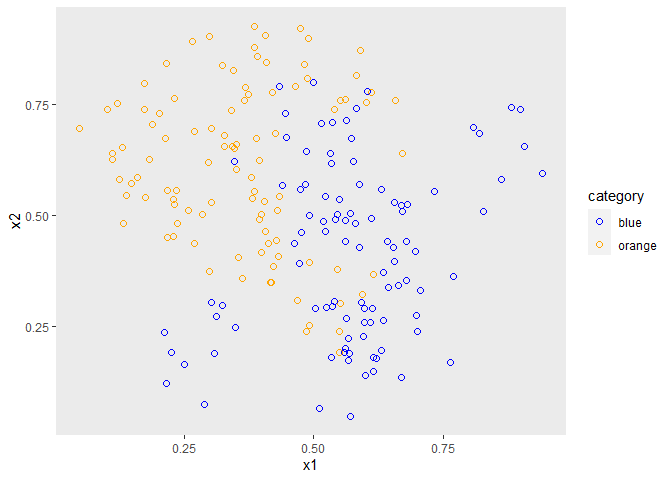
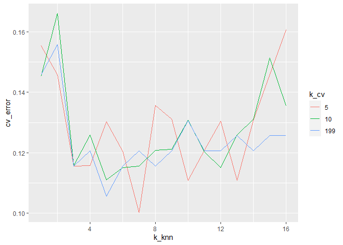
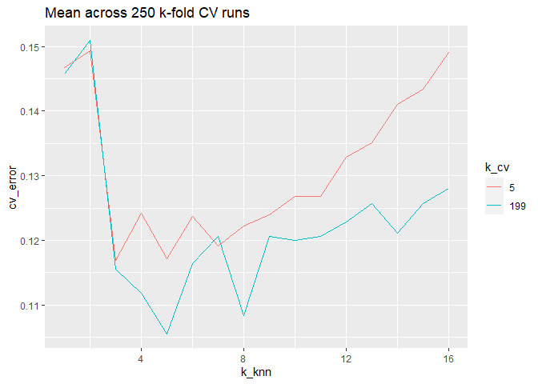

Classification in machine learning
================
Brett Melbourne
1 Feb 2024

This example is from Chapter 2.2.3 of James et al. (2021). An
Introduction to Statistical Learning. It is the simulated dataset in Fig
2.13.

``` r
library(ggplot2)
library(dplyr)
```

Orange-blue data:

``` r
orbludat <-  read.csv("data/orangeblue.csv")

orbludat |> 
    ggplot() +
    geom_point(aes(x=x1, y=x2, col=category), shape=1, size=2) +
    scale_color_manual(values=c("blue","orange")) +
    theme(panel.grid=element_blank())
```

<!-- -->

We’ll start by expanding the capability of our KNN function to handle
multiple x variables and the classification case with 2 categories.
We’ll also handle the case where different categories have identical
estimated probabilities by choosing the predicted category randomly, a
standard strategy in NN algorithms.

``` r
# KNN function for a data frame of x_new
# x:       x data of variables in columns (matrix, numeric)
# y:       y data, 2 categories (vector, character)
# x_new:   values of x variables at which to predict y (matrix, numeric)
# k:       number of nearest neighbors to average (scalar, integer)
# return:  predicted y at x_new (vector, character)
#
knn_classify2 <- function(x, y, x_new, k) {
    category <- unique(y) #get the two category names
    y_int <- ifelse(y == category[1], 1, 0) #convert categories to integers
    nx <- nrow(x)
    n <- nrow(x_new)
    c <- ncol(x_new)
    p_cat1 <- rep(NA, n)
    for ( i in 1:n ) {
    #   Distance of x_new to other x (Euclidean, i.e. sqrt(a^2+b^2+..))
        x_new_m <- matrix(x_new[i,], nx, c, byrow=TRUE)
        d <- sqrt(rowSums((x - x_new_m) ^ 2))
    #   Sort y ascending by d; break ties randomly
        y_sort <- y_int[order(d, sample(1:length(d)))]
    #   Mean of k nearest y data (gives probability of category 1)
        p_cat1[i] <- mean(y_sort[1:k])
    }
    y_pred <- ifelse(p_cat1 > 0.5, category[1], category[2])
    # Break ties if probability is equal (i.e. exactly 0.5)
    rnd_category <- sample(category, n, replace=TRUE) #vector of random labels
    tol <- 1 / (k * 10) #tolerance for checking equality
    y_pred <- ifelse(abs(p_cat1 - 0.5) < tol, rnd_category, y_pred)
    return(y_pred)
}
```

Test the output of the knn_classify2 function.

``` r
nm <- matrix(runif(8), nrow=4, ncol=2)
knn_classify2(x=as.matrix(orbludat[,c("x1","x2")]),
              y=orbludat$category,
              x_new=nm, 
              k=10)
```

    ## [1] "orange" "blue"   "blue"   "orange"

Plot. Use this block of code to try different values of k
(i.e. different numbers of nearest neighbors). There are some important
properties of KNN that you’ll notice. Smaller, even values of k will
more often have equal numbers of each category in the neighborhood,
leading to random tie breaks. These zones will show in the plot as
speckled intermingling of the two categories. Since these tie breaks are
random, repeated runs will produce slightly different plots.

``` r
grid_x  <- expand.grid(x1=seq(0, 1, by=0.01), x2=seq(0, 1, by=0.01))
pred_category <- knn_classify2(x=as.matrix(orbludat[,c("x1","x2")]),
                               y=orbludat$category,
                               x_new=as.matrix(grid_x),
                               k=10)
preds <- data.frame(grid_x, category=pred_category)

orbludat |> 
    ggplot() +
    geom_point(aes(x=x1, y=x2, col=category), shape=1, size=2) +
    geom_point(data=preds, aes(x=x1, y=x2, col=category), size=0.5) +
    scale_color_manual(values=c("blue","orange")) +
    theme(panel.grid=element_blank())
```

<!-- -->

k-fold CV for KNN. Be careful not to confuse the k’s!

``` r
# Function to divide a data set into random partitions for cross-validation
# n:       length of dataset (scalar, integer)
# k:       number of partitions (scalar, integer)
# return:  partition labels (vector, integer)
# 
random_partitions <- function(n, k) {
    min_n <- floor(n / k)
    extras <- n - k * min_n
    labels <- c(rep(1:k, each=min_n),rep(seq_len(extras)))
    partitions <- sample(labels, n)
    return(partitions)
}

# Function to perform k-fold CV for the KNN model algorithm on the orange-blue
# data from James et al. Ch 2.
# k_cv:    number of folds (scalar, integer)
# k_knn:   number of nearest neighbors to average (scalar, integer)
# return:  CV error as error rate (scalar, numeric)
#
cv_knn_orblu <- function(k_cv, k_knn) {
    orbludat$partition <- random_partitions(nrow(orbludat), k_cv)
    e <- rep(NA, k_cv)
    for ( i in 1:k_cv ) {
        test_data <- subset(orbludat, partition == i)
        train_data <- subset(orbludat, partition != i)
        pred_category <- knn_classify2(x=as.matrix(train_data[,c("x1","x2")]),
                               y=train_data$category,
                               x_new=as.matrix(test_data[,c("x1","x2")]),
                               k=k_knn)
        # Classification error rate, Eq. 2.8 James et al
        e[i] <- mean( test_data$category != pred_category )
    }
    cv_error <- mean(e)
    return(cv_error)
}
```

Use/test the function

``` r
cv_knn_orblu(k_cv=10, k_knn=10)
```

    ## [1] 0.1255263

``` r
cv_knn_orblu(k=nrow(orbludat), k_knn=10) #LOOCV
```

    ## [1] 0.1055276

Explore a grid of values for k_cv and k_knn

``` r
grid <- expand.grid(k_cv=c(5,10,nrow(orbludat)), k_knn=1:16)
cv_error <- rep(NA, nrow(grid))
set.seed(6456) #For reproducible results
for ( i in 1:nrow(grid) ) {
    cv_error[i] <- cv_knn_orblu(grid$k_cv[i], grid$k_knn[i])
    print(round(100 * i  /nrow(grid))) #monitoring
}
result1 <- cbind(grid, cv_error)
```

Plot the result.

``` r
result1 |> 
    ggplot() +
    geom_line(aes(x=k_knn, y=cv_error, col=factor(k_cv))) +
    labs(col="k_cv")
```

<!-- -->

We see a lot of variance in all choices for k in the cross validation,
which is partly due to randomly breaking ties in the KNN algorithm and
partly due to random partitions of the data. This run of LOOCV (k_cv =
199) identifies the KNN model with k_knn = 4 nearest neighbors as having
the best predictive performance but if we repeat the above with a
different random seed, we get different answers. Let’s look at LOOCV and
5-fold CV with many replicate CV runs with random partitions. This will
take about 30 minutes.

``` r
grid <- expand.grid(k_cv=c(5,nrow(orbludat)), k_knn=1:16)
reps <- 250
cv_error <- matrix(NA, nrow=nrow(grid), ncol=reps)
set.seed(8031) #For reproducible results in this text
for ( j in 1:reps ) {
    for ( i in 1:nrow(grid) ) {
        cv_error[i,j] <- cv_knn_orblu(grid$k_cv[i], grid$k_knn[i])
    }
    print(round(100 * j / reps)) #monitor
}
result2 <- cbind(grid, cv_error)
result2$mean_cv <- rowMeans(result2[,-(1:2)])
```

Plot the result.

``` r
result2 |>
    select(k_cv, k_knn, mean_cv) |>
    rename(cv_error=mean_cv) |>
    ggplot() +
    geom_line(aes(x=k_knn, y=cv_error, col=factor(k_cv))) +
    labs(title=paste("Mean across",reps,"k-fold CV runs"), col="k_cv")
```

<!-- -->

and we could use the following code to print out the detailed numbers:

``` r
result2 |> 
    select(k_cv, k_knn, mean_cv) |>
    rename(cv_error=mean_cv) |>
    arrange(k_cv)
```

If we increase reps to 1000, the CV error plot above remains the same,
so the jaggedness in the error curve is now stable (i.e. it’s not noise
due to random partitioning in the k-fold CV algorithm). A very
interesting thing we discover, most clear in the 5-fold CV, is that
small even numbers for k_knn have a higher error rate. This is because
of randomness in breaking ties, which adds noise to the KNN model
algorithm. There can’t be ties for odd values of k_knn, so their error
is lower.

Which value for k_knn to choose is not super clear cut. 5-fold CV
identifies k_knn=3 but k_knn=5 is essentially as good. LOOCV identifies
k_knn=5, with k_knn=8 next best but the LOOCV profile is quite jagged.
Given the overall shape of both CV profiles, I’d pick k_knn=5, as it’s
about at the mid point of the downward trend in the CV error and an odd
number is probably better than even. It’s not so important that we pick
“the best” option, we just need one option that predicts accurately.

The result here differs from Fig. 2.17 in James et al. Here, we
**estimated** the out-of-sample error rate as the CV error rate, which
is the best we can do given a small set of data. In Fig. 2.17 the test
error rate is the theoretical out-of-sample error rate for these
training data (measured from a large sample of test data drawn from the
“true” model). Hence the CV error rate has underestimated the true error
rate and identified a different k_knn than the “true” optimal value in
2.17.
