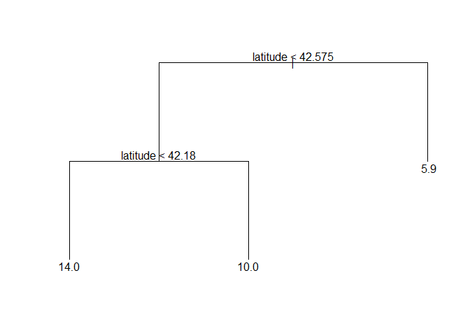
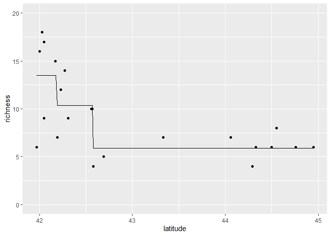
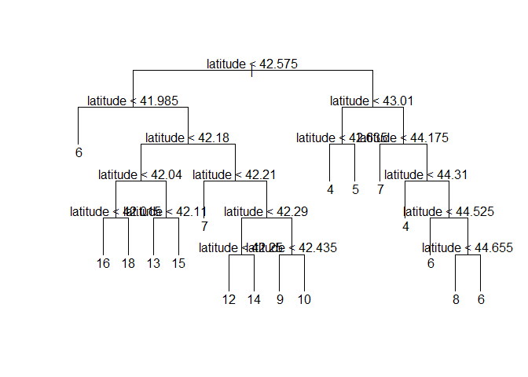
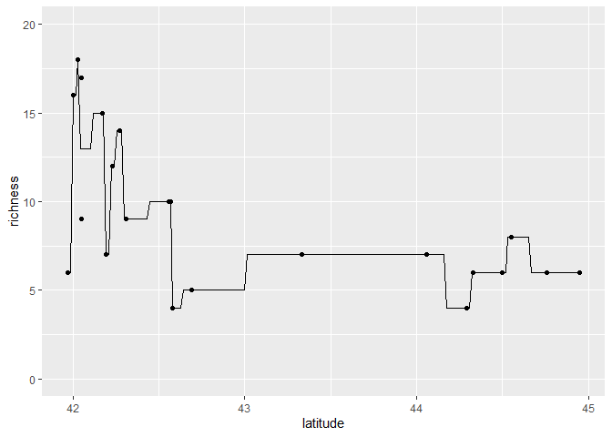
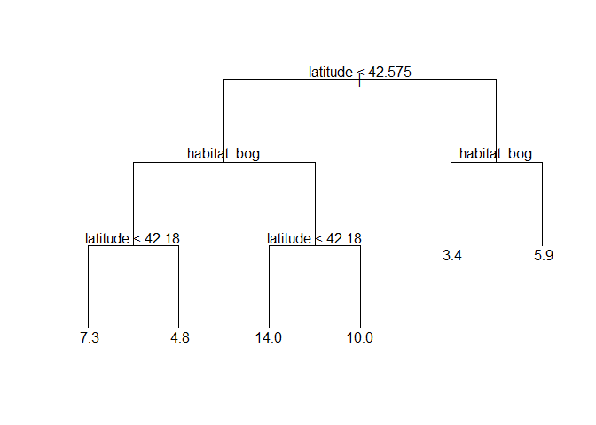
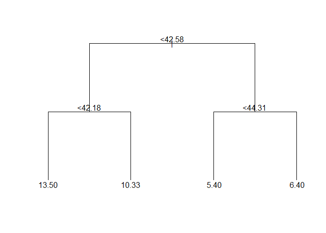
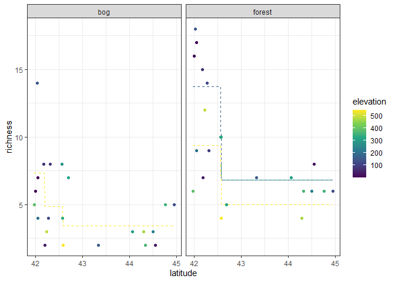
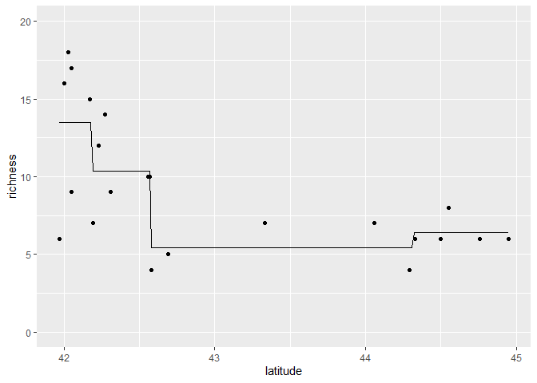

Ant data: decision trees
================
Brett Melbourne
6 Feb 2024

Decision trees for the regression case illustrated with the ants data.
We start with a regression tree for a single predictor variable, then
look at regression trees with multiple predictors.

``` r
library(ggplot2)
library(dplyr)
library(tree)
```

Forest ant data:

``` r
forest_ants <- read.csv("data/ants.csv") |> 
    filter(habitat=="forest") |> 
    select(latitude, richness)
```

Tree model + training algorithm. The default training algorithm has
stopping rules that include the number of observations in nodes and the
variance within nodes.

``` r
fit <- tree(richness ~ latitude, data=forest_ants)
plot(fit, type="uniform")
text(fit, pretty=0, digits=2)
```

<!-- -->

We see that the tree splits latitude twice, first at 42.575 then at
42.18 to give three terminal nodes. The predicted richness shown for
each node is the mean of the data in each node.

Plot predictions with the data.

``` r
grid_latitude  <- seq(min(forest_ants$latitude), max(forest_ants$latitude), length.out=201)
grid_data <- data.frame(latitude=grid_latitude)
preds <- cbind(grid_data, richness=predict(fit, newdata=grid_data))

forest_ants |> 
    ggplot() +
    geom_point(aes(x=latitude, y=richness)) +
    geom_line(data=preds, aes(x=latitude, y=richness)) +
    coord_cartesian(ylim=c(0,20))
```

<!-- -->

We see that for a single predictor variable, a regression tree
partitions the predictor (x axis) into segments (three segments in this
case).

In contrast, the following fit is for a deeper tree. We have modified
the stopping rules of the training algorithm to allow splits all the way
to individual data points.

``` r
fit <- tree(richness ~ latitude, data=forest_ants, 
            control=tree.control(nobs=nrow(forest_ants), minsize=2, mindev=0))
plot(fit, type="uniform")
text(fit, pretty=0, digits=2)
```

<!-- -->

Plot predictions with the data.

``` r
grid_latitude  <- seq(min(forest_ants$latitude), max(forest_ants$latitude), length.out=201)
grid_data <- data.frame(latitude=grid_latitude)
preds <- cbind(grid_data, richness=predict(fit, newdata=grid_data))

forest_ants |> 
    ggplot() +
    geom_point(aes(x=latitude, y=richness)) +
    geom_line(data=preds, aes(x=latitude, y=richness)) +
    coord_cartesian(ylim=c(0,20))
```

<!-- -->

For this tree the predictions follow the data except for the one case
where two data points shared the same latitude.

There is more data in the ants dataset, including two more predictor
variables: habitat (bog or forest) and elevation (m).

``` r
ants <- read.csv("data/ants.csv") |> 
    select(-site) |> 
    mutate_if(is.character, factor)
head(ants)
```

    ##   habitat latitude elevation richness
    ## 1  forest    41.97       389        6
    ## 2  forest    42.00         8       16
    ## 3  forest    42.03       152       18
    ## 4  forest    42.05         1       17
    ## 5  forest    42.05       210        9
    ## 6  forest    42.17        78       15

Fit a tree that includes both latitude and habitat as predictors

``` r
fit <- tree(richness ~ latitude + habitat, data=ants)
plot(fit, type="uniform")
text(fit, pretty=0, digits=2)
```

<!-- -->

We see the tree has nodes that split at both predictor variables. First
it splits by latitude, then it splits by habitat, then it splits by
latitude again. At the habitat nodes, bog is to the left while forest is
to the right.

Plot the prediction from the fitted model

``` r
grid_data  <- expand.grid(
    latitude=seq(min(ants$latitude), max(ants$latitude), length.out=201),
    habitat=factor(c("forest","bog")))
preds <- cbind(grid_data, richness=predict(fit, newdata=grid_data))

ants |> 
    ggplot() +
    geom_point(aes(x=latitude, y=richness, col=habitat)) +
    geom_line(data=preds, aes(x=latitude, y=richness, col=habitat)) +
    coord_cartesian(ylim=c(0,20))
```

<!-- -->

Plotting the predicted richness reveals that we have effectively modeled
richness as a nonlinear combination, or “interaction”, of habitat and
latitude. The stepwise functions broadly (arguably crudely) capture the
pattern of a different nonlinear relationship between richness and
latitude in each habitat.

Now fit a tree with all three predictor variables

``` r
fit <- tree(richness ~ latitude + habitat + elevation, data=ants)
plot(fit, type="uniform")
text(fit, pretty=0, digits=2)
```

<!-- -->

This tree has splits for all three predictor variables. First it splits
by latitude, then by habitat, and then it splits again by elevation in
forest habitat only. One interpretation is that elevation is important
to predict richness only in forest.

It’s harder to visualize the prediction from this fit since we have
multiple predictor dimensions. Here is one visualizaton:

``` r
grid_data  <- expand.grid(
    latitude=seq(min(ants$latitude), max(ants$latitude), length.out=201),
    habitat=factor(c("forest","bog")),
    elevation=seq(min(ants$elevation), max(ants$elevation), length.out=51))
preds <- cbind(grid_data, richness=predict(fit, newdata=grid_data))

ants |> 
    ggplot() +
    geom_line(data=preds, 
              aes(x=latitude, y=richness, col=elevation, group=factor(elevation)),
              linetype=2) +
    geom_point(aes(x=latitude, y=richness, col=elevation)) +
    facet_wrap(vars(habitat)) +
    scale_color_viridis_c() +
    theme_bw()
```

<!-- -->

The plot shows that elevation doesn’t contribute to prediction in the
bog habitat but we’re modeling different nonlinearities in the forest
habitat for lower and higher elevations. Effectively we are crudely
modeling the interaction between habitat, latitude, and elevation by
dividing the predictor space into 7 chunks. Since our goal is prediction
we’d be most interested in plotting predictions within some region to
make a map of predicted species richness for the area from which the
data came. For that we’d need maps of the predictor variables but such a
visualization scales to any number of predictor variables.

The prediction error (i.e. the out-of-sample error) from a regression
tree can be estimated by k-fold cross validation in the usual way.

``` r
# Function to divide a data set into random partitions for cross-validation
# n:       length of dataset (scalar, integer)
# k:       number of partitions (scalar, integer)
# return:  partition labels (vector, integer)
# 
random_partitions <- function(n, k) {
    min_n <- floor(n / k)
    extras <- n - k * min_n
    labels <- c(rep(1:k, each=min_n),rep(seq_len(extras)))
    partitions <- sample(labels, n)
    return(partitions)
}

# Function to perform k-fold CV for the tree model on ants data
# k:       number of partitions (scalar, integer)
# return:  CV error as MSE (scalar, numeric)
#
cv_tree_ants <- function(k) {
    ants$partition <- random_partitions(nrow(ants), k)
    e <- rep(NA, k)
    for ( i in 1:k ) {
        test_data <- subset(ants, partition == i)
        train_data <- subset(ants, partition != i)
        train_tree <- tree(richness ~ latitude + habitat + elevation, data=train_data)
        pred_richness <- predict(train_tree, newdata=test_data)
        e[i] <- mean((test_data$richness - pred_richness) ^ 2)
    }
    cv_error <- mean(e)
    return(cv_error)
}
```

Test the function

``` r
cv_tree_ants(k=5)
```

    ## [1] 12.58594

``` r
cv_tree_ants(k=nrow(ants)) #LOOCV
```

    ## [1] 12.68253

Running the above two lines of code multiple times we find lots of
variability in the prediction error estimate for 5-fold CV due to the
randomness of the partitions. LOOCV does not change because the tree
model and training algorithms are deterministic. As before, we’ll need
repeated partitions for a more stable estimate of the 5-fold CV:

``` r
set.seed(3127)
reps <- 500
cv_error <- rep(NA, reps)
for ( i in 1:reps ) {
    cv_error[i] <- cv_tree_ants(k=5)
}
```

A histogram suggests the CV replicates are well behaved

``` r
hist(cv_error)
```

<!-- -->

Estimated error and its Monte Carlo error (about +/- 0.1)

``` r
mean(cv_error)
```

    ## [1] 13.15425

``` r
sd(cv_error) / sqrt(reps)
```

    ## [1] 0.08818662
