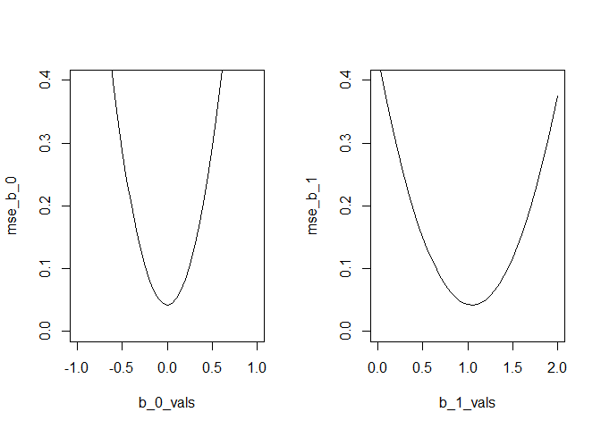
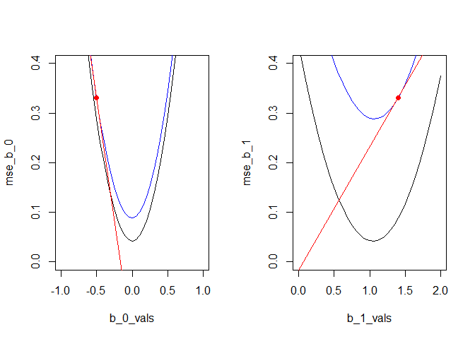
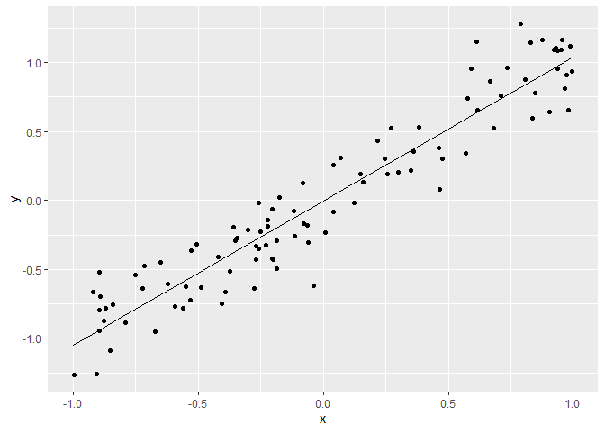
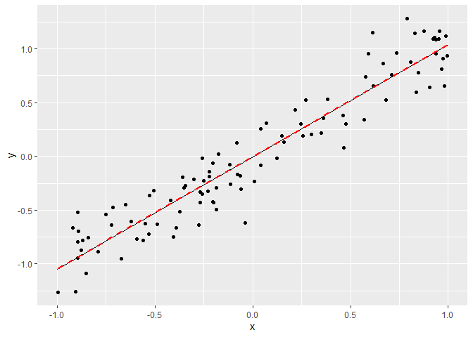
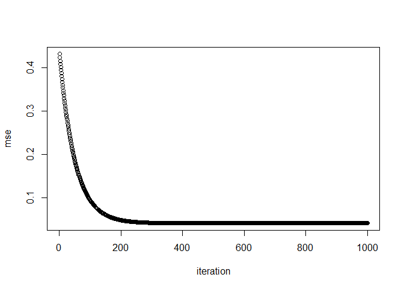

Gradient descent training algorithm
================
Brett Melbourne
19 Feb 2024

Gradient descent illustrated with a simple linear model. This is first
draft code with a lot of copy-pasted blocks and quick rudimentary plots
that I used to prepare the lecture. I’ll clean this up by making
functions for repeated components.

``` r
library(ggplot2)
```

Generate some data for a linear model with one x variable. I am making
choices here that are good for illustration as the algorithm will
converge quickly and convergence is balanced between the parameters.
This won’t generally be true (e.g. when parameters are on different
scales or x is not centered at 0).

``` r
set.seed(7362)
b_0 <- 0
b_1 <- 1
n <- 100 #number of data points
x <- runif(n, -1, 1)
y <- rnorm(length(x), mean=b_0 + b_1 * x, sd=0.25)
ggplot(data.frame(x, y)) +
    geom_point(aes(x, y))
```

<!-- -->

What does the MSE cost function look like?

``` r
grid <- expand.grid(b_0 = seq(-1, 1, 0.05), b_1 = seq(0, 2, 0.05))
mse <- rep(NA, nrow(grid))
for ( i in 1:nrow(grid) ) {
    y_pred <- grid$b_0[i] + grid$b_1[i] * x
    mse[i] <- sum((y - y_pred) ^ 2) / n
}
mse_grid <- cbind(grid, mse)

par(mfrow=c(1,2))
with(mse_grid, plot(b_0, mse, ylim=c(0, 0.4)))
with(mse_grid, plot(b_1, mse, ylim=c(0, 0.4)))
```

<!-- -->

Looking at just the underside (extracted from output above) PS the
underside is the curve for that parameter holding the other at its
optimum

``` r
b_0_vals <- unique(mse_grid$b_0)
mse_b_0 <- rep(NA, length(b_0_vals))
for ( i in 1:length(b_0_vals) ) {
    mse_b_0[i] <- min(mse_grid[mse_grid$b_0 == b_0_vals[i],"mse"])
}

b_1_vals <- unique(mse_grid$b_1)
mse_b_1 <- rep(NA, length(b_1_vals))
for ( i in 1:length(b_1_vals) ) {
    mse_b_1[i] <- min(mse_grid[mse_grid$b_1 == b_1_vals[i],"mse"])
}
par(mfrow=c(1,2))
plot(b_0_vals, mse_b_0, type="l", ylim=c(0, 0.4))
plot(b_1_vals, mse_b_1, type="l", ylim=c(0, 0.4))
```

<!-- -->

Calculate the gradient of the MSE cost function

``` r
b_0 <- -0.5
b_1 <- 1.4
y_pred <- b_0 + b_1 * x
r <- y - y_pred
db_1 <- -2 * sum(r * x) / n
db_0 <- -2 * sum(r) / n
```

Plot the gradient

``` r
par(mfrow=c(1,2))

grid_b_0 <- seq(-1, 1, 0.05)
mse <- rep(NA, length(grid_b_0))
for ( i in 1:length(grid_b_0) ) {
    y_pred <- grid_b_0[i] + b_1 * x
    mse[i] <- sum((y - y_pred) ^ 2) / n
}
plot(b_0_vals, mse_b_0, type="l", ylim=c(0, 0.4))
lines(grid_b_0, mse, col="blue")
y_pred <- b_0 + b_1 * x
mse <- sum((y - y_pred) ^ 2) / n
points(b_0, mse, col="red", pch=19)
abline(mse - db_0 * b_0, db_0, col="red")

grid_b_1 <- seq(0, 2, 0.05)
mse <- rep(NA, length(grid_b_1))
for ( i in 1:length(grid_b_1) ) {
    y_pred <- b_0 + grid_b_1[i] * x
    mse[i] <- sum((y - y_pred) ^ 2) / n
}
plot(b_1_vals, mse_b_1, type="l", ylim=c(0, 0.4))
lines(grid_b_1, mse, col="blue")
y_pred <- b_0 + b_1 * x
mse <- sum((y - y_pred) ^ 2) / n
points(b_1, mse, col="red", pch=19)
abline(mse - db_1 * b_1, db_1, col="red")
```

<!-- -->

Gradient descent algorithm:

    set lambda
    make initial guess for b_0, b_1
    for many iterations
        find gradient at b_0, b_1
        step down: b = b - lambda * gradient(b)
    print b_0, b_1

Code this algorithm in R

``` r
lambda <- 0.01
b_0 <- -0.5
b_1 <- 1.4
iter <- 10000
for ( i in 1:iter ) {
    # find gradient at b_0, b_1
    y_pred <- b_0 + b_1 * x
    r <- y - y_pred
    db_1 <- -2 * sum(r * x) / n
    db_0 <- -2 * sum(r) / n
    # step down
    b_0 <- b_0 - lambda * db_0
    b_1 <- b_1 - lambda * db_1
}
b_0
```

    ## [1] -0.003105703

``` r
b_1
```

    ## [1] 1.043972

Compare to the inbuilt algorithm (a numerical solution)

``` r
lm(y~x)
```

    ## 
    ## Call:
    ## lm(formula = y ~ x)
    ## 
    ## Coefficients:
    ## (Intercept)            x  
    ##   -0.003106     1.043972

Animate the algorithm

``` r
# Pause for the specified number of seconds.
pause <- function( secs ) {
    start_time <- proc.time()
    while ( (proc.time() - start_time)["elapsed"] < secs ) {
        #Do nothing
    }
}

# Function to make gradient plots
make_plots <- function() {
    grid_b_0 <- seq(-1, 1, 0.05)
    mse <- rep(NA, length(grid_b_0))
    for ( i in 1:length(grid_b_0) ) {
        y_pred <- grid_b_0[i] + b_1 * x
        mse[i] <- sum((y - y_pred) ^ 2) / n
    }
    plot(b_0_vals, mse_b_0, type="l", ylim=c(0, 0.4),
         main=paste("Iteration", j))
    lines(grid_b_0, mse, col="blue")
    y_pred <- b_0 + b_1 * x
    mse <- sum((y - y_pred) ^ 2) / n
    points(b_0, mse, col="red", pch=19)
    abline(mse - db_0 * b_0, db_0, col="red")
    
    grid_b_1 <- seq(0, 2, 0.05)
    mse <- rep(NA, length(grid_b_1))
    for ( i in 1:length(grid_b_1) ) {
        y_pred <- b_0 + grid_b_1[i] * x
        mse[i] <- sum((y - y_pred) ^ 2) / n
    }
    plot(b_1_vals, mse_b_1, type="l", ylim=c(0, 0.4))
    lines(grid_b_1, mse, col="blue")
    y_pred <- b_0 + b_1 * x
    mse <- sum((y - y_pred) ^ 2) / n
    points(b_1, mse, col="red", pch=19)
    abline(mse - db_1 * b_1, db_1, col="red")
}

# Gradient descent algorithm with gradient plots
par(mfrow=c(1,2))
epoch <- 100
lambda <- 0.01
b_0 <- -0.5
b_1 <- 1.4
iter <- 1000
for ( j in 0:iter ) {
    # find gradient at b_0, b_1
    y_pred <- b_0 + b_1 * x
    r <- y - y_pred
    db_1 <- -2 * sum(r * x) / n
    db_0 <- -2 * sum(r) / n

    # Make plots
    if ( (j <= 50 & j %% 5 == 0 ) | j %% epoch == 0 ) {
        make_plots()
        pause(1)
    }
    
    # step down
    b_0 <- b_0 - lambda * db_0
    b_1 <- b_1 - lambda * db_1
    
}
```

Boosted linear regression algorithm

``` r
# load y, x, xnew
# x and y are already loaded above

# xnew will be a grid of new predictor values on which to form predictions:
xnew  <- data.frame(x=seq(-1, 1, 0.1))

# Parameters
lambda <- 0.01 #Shrinkage/learning rate/descent rate
iter <- 1000

# Set f_hat, r
f_hat <- rep(0, nrow(xnew))
r <- y

mse <- rep(NA, iter) #store MSE to visualize descent
for ( m in 1:iter ) {
#   train model on r and x
    data_m <- data.frame(r, x)
    fit_m <- lm(r ~ x, data=data_m)
#   predict residuals from trained model
    r_hat_m <- predict(fit_m)
#   update residuals (gradient descent)
    r <- r - lambda * r_hat_m
    mse[m] <- sum(r ^ 2) / n
#   predict y increment from trained model
    f_hat_m <- predict(fit_m, newdata=xnew)
#   update prediction
    f_hat <- f_hat + lambda * f_hat_m
#   monitoring
    print(m)
}

# return f_hat
boost_preds <- f_hat
predict(lm(y~x), newdata=xnew)
```

Plot predictions

``` r
preds <- cbind(xnew, y_pred=boost_preds)
g <- data.frame(x, y) |> 
    ggplot(aes(x=x, y=y)) +
    geom_point() +
    geom_line(data=preds, aes(x=x, y=y_pred))
g
```

<!-- -->

Same as optimal linear regression

``` r
g + geom_smooth(method = lm, se = FALSE, col="red", linetype=2)
```

    ## `geom_smooth()` using formula = 'y ~ x'

<!-- -->

Here’s how the algorithm descended the loss function (MSE)

``` r
plot(1:iter, mse, xlab="iteration")
```

<!-- -->
