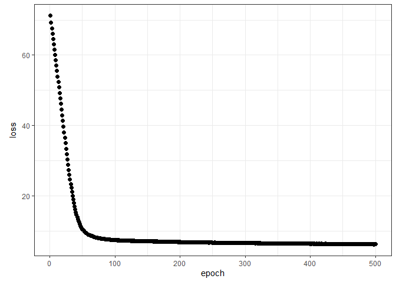
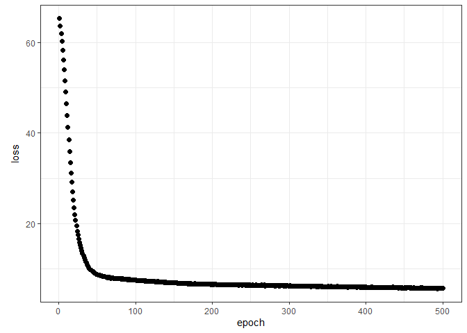

Ant data: neural network architectures
================
Brett Melbourne
28 Feb 2024

Different neural network architectures illustrated with the ants data
using Keras (tensorflow). We compare a wide to a deep architecture.

It’s important to note that it isn’t sensible to fit these 151 parameter
models to our small dataset of 44 data points without a lot of
regularization and of course tuning and k-fold cross validation, the
latter of which would add so much computation that it’s not worth it.
This code is to illustrate the effect of different architectures and for
comparison to the previous machine learning approaches we have used with
this dataset.

``` r
reticulate::use_condaenv(condaenv = "r-tensorflow")
library(ggplot2)
library(dplyr)
library(keras)
```

Ant data with 3 predictors of species richness

``` r
ants <- read.csv("data/ants.csv") |> 
    select(richness, latitude, habitat, elevation) |> 
    mutate(habitat=factor(habitat))
```

Prepare the data and a set of new x to predict

``` r
xtrain <- ants[,-1] |> 
    mutate(across(where(is.numeric), scale)) |> 
    mutate(bog=ifelse(habitat=="bog", 1, 0)) |>
    mutate(forest=ifelse(habitat=="forest", 1, 0)) |> 
    select(latitude, bog, forest, elevation) |> #drop original categorical var
    as.matrix()

ytrain <- ants[,1]

grid_data  <- expand.grid(
    latitude=seq(min(ants$latitude), max(ants$latitude), length.out=201),
    habitat=factor(c("forest","bog")),
    elevation=seq(min(ants$elevation), max(ants$elevation), length.out=51))

x <- grid_data |> 
    mutate(across(where(is.numeric), scale)) |> 
    mutate(bog=ifelse(habitat=="bog", 1, 0)) |>
    mutate(forest=ifelse(habitat=="forest", 1, 0)) |> 
    select(latitude, bog, forest, elevation) |> #drop original categorical var
    as.matrix()
```

A wide model with 25 units

``` r
tensorflow::set_random_seed(6590)
modnn2 <- keras_model_sequential(input_shape = ncol(xtrain)) |>
    layer_dense(units = 25) |>
    layer_activation("relu") |> 
    layer_dense(units = 1)
modnn2
```

    ## Model: "sequential"
    ## ________________________________________________________________________________
    ##  Layer (type)                       Output Shape                    Param #     
    ## ================================================================================
    ##  dense_1 (Dense)                    (None, 25)                      125         
    ##  activation (Activation)            (None, 25)                      0           
    ##  dense (Dense)                      (None, 1)                       26          
    ## ================================================================================
    ## Total params: 151 (604.00 Byte)
    ## Trainable params: 151 (604.00 Byte)
    ## Non-trainable params: 0 (0.00 Byte)
    ## ________________________________________________________________________________

``` r
compile(modnn2, optimizer="rmsprop", loss="mse")
fit(modnn2, xtrain, ytrain, epochs = 500, batch_size=4) -> history
```

``` r
# save_model_tf(modnn2, "07_5_ants_nnet_architecture_files/saved/modnn2")
# save(history, file="07_5_ants_nnet_architecture_files/saved/modnn2_history.Rdata")
modnn2 <- load_model_tf("07_5_ants_nnet_architecture_files/saved/modnn2")
load("07_5_ants_nnet_architecture_files/saved/modnn2_history.Rdata")
```

``` r
plot(history, smooth=FALSE, theme_bw=TRUE)
```

<!-- -->

``` r
npred <- predict(modnn2, x)
```

    ## 641/641 - 1s - 968ms/epoch - 2ms/step

``` r
preds <- cbind(grid_data, richness=npred)
ants |> 
    ggplot() +
    geom_line(data=preds, 
              aes(x=latitude, y=richness, col=elevation, group=factor(elevation)),
              linetype=2) +
    geom_point(aes(x=latitude, y=richness, col=elevation)) +
    facet_wrap(vars(habitat)) +
    scale_color_viridis_c() +
    theme_bw()
```

<!-- -->

For this wide model, we get quite a flexible fit with a good deal of
nonlinearity and some complexity to the surface (e.g. the fold evident
in the bog surface).

A deep model with 25 units

``` r
tensorflow::set_random_seed(7855)
modnn3 <- keras_model_sequential(input_shape = ncol(xtrain)) |>
    layer_dense(units = 5) |>
    layer_activation("relu") |>
    layer_dense(units = 5) |>
    layer_activation("relu") |> 
    layer_dense(units = 5) |>
    layer_activation("relu") |> 
    layer_dense(units = 5) |>
    layer_activation("relu") |> 
    layer_dense(units = 5) |>
    layer_activation("relu") |> 
    layer_dense(units = 1)
modnn3
```

    ## Model: "sequential_1"
    ## ________________________________________________________________________________
    ##  Layer (type)                       Output Shape                    Param #     
    ## ================================================================================
    ##  dense_7 (Dense)                    (None, 5)                       25          
    ##  activation_5 (Activation)          (None, 5)                       0           
    ##  dense_6 (Dense)                    (None, 5)                       30          
    ##  activation_4 (Activation)          (None, 5)                       0           
    ##  dense_5 (Dense)                    (None, 5)                       30          
    ##  activation_3 (Activation)          (None, 5)                       0           
    ##  dense_4 (Dense)                    (None, 5)                       30          
    ##  activation_2 (Activation)          (None, 5)                       0           
    ##  dense_3 (Dense)                    (None, 5)                       30          
    ##  activation_1 (Activation)          (None, 5)                       0           
    ##  dense_2 (Dense)                    (None, 1)                       6           
    ## ================================================================================
    ## Total params: 151 (604.00 Byte)
    ## Trainable params: 151 (604.00 Byte)
    ## Non-trainable params: 0 (0.00 Byte)
    ## ________________________________________________________________________________

``` r
compile(modnn3, optimizer="rmsprop", loss="mse")
fit(modnn3, xtrain, ytrain, epochs = 500, batch_size=4) -> history
```

``` r
# save_model_tf(modnn3, "07_5_ants_nnet_architecture_files/saved/modnn3")
# save(history, file="07_5_ants_nnet_architecture_files/saved/modnn3_history.Rdata")
modnn3 <- load_model_tf("07_5_ants_nnet_architecture_files/saved/modnn3")
load("07_5_ants_nnet_architecture_files/saved/modnn3_history.Rdata")
```

``` r
plot(history, smooth=FALSE, theme_bw=TRUE)
```

<!-- -->

``` r
npred <- predict(modnn3, x)
```

    ## 641/641 - 1s - 772ms/epoch - 1ms/step

``` r
preds <- cbind(grid_data, richness=npred)
ants |> 
    ggplot() +
    geom_line(data=preds, 
              aes(x=latitude, y=richness, col=elevation, group=factor(elevation)),
              linetype=2) +
    geom_point(aes(x=latitude, y=richness, col=elevation)) +
    facet_wrap(vars(habitat)) +
    scale_color_viridis_c() +
    theme_bw()
```

<!-- -->

The deep model has more complexity to its fit, for example more folds
and bends in the surface, for the same number of parameters and epochs.
You can also see that this model is probably nonsense overall.
